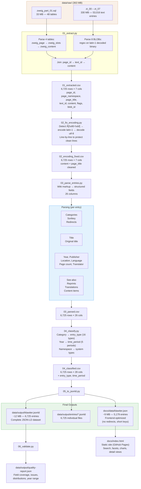

# Data Flow

Visualization of the complete data pipeline from raw source to final outputs.

## Pipeline Overview



## Data Transformations Per Step

### Step 1: Extract (Raw → CSV)

| What | Source | Destination |
|------|--------|------------|
| Page metadata | `zweig_page` INSERT rows | `page_id`, `page_namespace`, `page_title` |
| Content address | `zweig_slots` → `zweig_content` chain | `text_id` |
| Actual text | BLOB file regex match on `text_id` | `content`, `flags`, `blob_id` |

**Loss point**: 4 of 6,725 pages have no content in BLOBs (text_id not found).

### Step 2: Fix Encoding (CSV → CSV)

| What | Before | After |
|------|--------|-------|
| `content` field | 57.3% Mojibake (ä, ö, ü...) | 0% Mojibake |
| `page_title` field | Some Mojibake | 0% Mojibake |
| All other fields | Unchanged | Unchanged |

**Risk point**: Line-wise repair could theoretically fail on mixed-encoding lines.

### Step 3: Parse (CSV → CSV)

| Raw content pattern | Extracted field | Method |
|---------------------|----------------|--------|
| `'''Bold Title'''` | `title` | Regex on bold markup |
| `[[Category:Fiction]]` | `categories`, `main_category` | Regex extraction |
| `1922` | `year`, `all_years` | Year regex (1700–2039) |
| `Insel-Verlag` | `publisher` | 3 regex families |
| `Leipzig` | `location`, `all_locations` | City list matching |
| `(German)` in category | `language`, `language_iso` | Category suffix extraction |
| `432 p.` | `page_count` | Page count patterns |
| `Translated by Name` | `translator` | 8 language-specific patterns |
| `'''See:''' [[Link]]` | `see_also` | Wiki link extraction |
| `'''Reprinted in:'''` block | `reprints` | Block extraction |
| `'''Translations:'''` block | `translations` | Block extraction |
| `'''Contents'''` block | `content_items` | Block extraction |
| `#REDIRECT [[Target]]` | `is_redirect`, `redirect_target` | Redirect detection |

**Main loss points**: Publisher (34.5%), translator (35.1%), location (67.8%).

### Step 4: Classify (CSV → CSV)

| Input | Output | Method |
|-------|--------|--------|
| `main_category` | `entry_type` | Category → type map (16 types) |
| `raw_content` keywords | `entry_type` (fallback) | Content keyword matching |
| `page_namespace` | `entry_type` | Non-zero → system type |
| `year` | `time_period` | Year range → period (5 periods) |

### Step 5: JSON-LD (CSV → JSON)

| CSV column | JSON-LD property | Transformation |
|------------|-----------------|---------------|
| `title` | `klawiter:title` | String |
| `year` | `klawiter:year` | String → Integer |
| `categories` | `klawiter:categories` | JSON string → Array |
| `see_also` | `klawiter:seeAlso` | JSON string → Array |
| (all numeric fields) | `klawiter:*` | String → Integer |
| (all JSON list fields) | `klawiter:*` | JSON string → parsed |

**Three outputs**:
- `klawiter.jsonld`: All 6,725 entries with `@context` + `klawiter:` namespace
- `entries/*.jsonld`: One file per entry
- `klawiter.json`: Frontend-optimized (no `klawiter:` prefix, no redirects in entries array, redirects as separate map)

### Step 6: Validate (JSON → Report)

Checks per entry:
- Title present (for non-redirects)
- Entry type present
- Year in valid range (1800–2035)
- No residual Mojibake
- fullBibliographicEntry present

Aggregates:
- Field coverage percentages
- Entry type distribution
- Language distribution
- Time period distribution
- Namespace distribution

## What Reaches the Frontend

```
docs/data/klawiter.json
├── name, compiler, institution
├── totalEntries: 5,179 (all non-redirects across all namespaces)
├── entries[]: array of objects with short keys
│   ├── @type, @id
│   ├── entryType, title, year, timePeriod
│   ├── publisher, location, language, languageCode
│   ├── pageCount, translator
│   ├── categories, mainCategory
│   ├── seeAlso, reprints, translations, contentItems
│   ├── fullBibliographicEntry
│   ├── sourcePageId, sourceTextId, sourceBlobId
│   └── pageNamespace
└── redirects{}: { "title" → page_id } map (1,078 resolved)
```

The frontend loads this single JSON file and provides:
- Full-text search (FlexSearch index on title, content, categories)
- Faceted filtering (type, language, period, location)
- Detail view per entry
- Dashboard with statistics and charts
- JSON-LD export per entry
