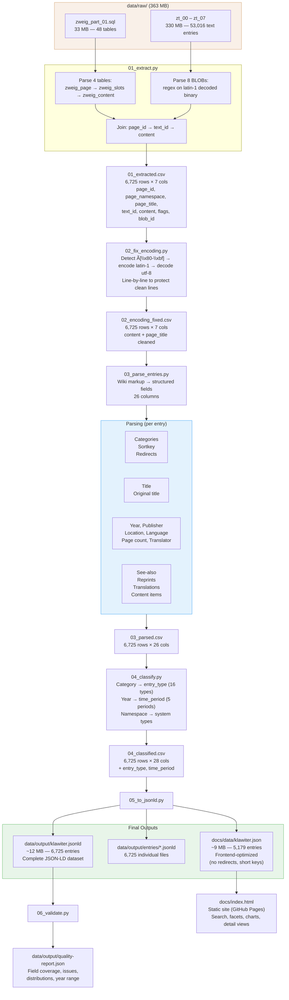

# Pipeline

The extraction pipeline converts raw data from the MediaWiki database into [[data|JSON-LD]]. It runs in 8 stages (01, 02, 03, 03b, 03c, 04, 05, 06 plus the verify and reconcile helpers), requires no MySQL, and is idempotent. See [[architecture]] for key technical decisions.

## Source Data

### MediaWiki Table Structure

The original wiki stored content in a 4-layer chain:

```
zweig_page (6,725 pages)
  → page_latest → zweig_revision
    → rev_id → zweig_slots
      → slot_content_id → zweig_content
        → "tt:XXXXX" → text ID in BLOB files
```

**zweig_page**: `page_id` (unique), `page_namespace` (0 = main namespace, 6,296 pages), `page_title` (underscores instead of spaces), `page_latest` (current revision).

Total pages in database: 6,725. Breakdown by namespace:

| Namespace | Pages | Content |
|-----------|-------|---------|
| 0 (Main) | 6,296 | **Bibliography entries — extracted by pipeline** |
| 14 (Category) | 420 | Category descriptions — currently not extracted |
| 8 (MediaWiki) | 5 | System messages |
| 10 (Template) | 2 | Templates |
| 12 (Help) | 1 | Help page |
| 6 (File) | 1 | File description |

**zweig_content**: `content_address` in format `tt:XXXXX` — pointer to text ID in BLOB.

### BLOB Files

8 binary files (`zt_00` to `zt_07`), 363 MB total. Each contains SQL INSERT statements:

```sql
INSERT INTO zweig_text VALUES
  (835, _binary 'Wiki content here...', _binary 'utf-8'),
  (848, _binary 'Next entry...', _binary 'utf-8');
```

| File | Size | Entries |
|------|------|---------|
| zt_00 | 27.4 MB | 2,736 |
| zt_01 | 49.0 MB | 6,869 |
| zt_02 | 48.7 MB | 5,841 |
| zt_03 | 49.0 MB | 11,613 |
| zt_04 | 48.1 MB | 10,587 |
| zt_05 | 48.2 MB | 5,731 |
| zt_06 | 49.3 MB | 8,217 |
| zt_07 | 10.6 MB | 1,422 |

The BLOBs contain not only current versions but all historical revisions (53,016 text entries for 6,296 pages).

### SQL Dump

Three SQL files exist in `data/raw/`:

| File | Size | Content | Used by pipeline |
|------|------|---------|-----------------|
| `zweig_part_01.sql` | 33 MB | 48 CREATE TABLE + INSERT data for all tables except `zweig_text` | **Yes** |
| `zweig_part_02.sql` | 522 B | Empty `zweig_text` table schema (no data) | No (data is in zt_* files) |
| `zweig_part_03.sql` | 21 KB | System metadata (users, watchlists, update logs) | No (not bibliography data) |

### Wiki Markup

Bibliography entries use MediaWiki markup:

| Markup | Meaning |
|--------|---------|
| `'''Text'''` | Bold (work titles, structural markers) |
| `''Text''` | Italic (publication titles) |
| `[[Target]]` | Internal link |
| `[[Target\|Display]]` | Link with display text |
| `[[Category:Name]]` | Category assignment |
| `{{DEFAULTSORTKEY:...}}` | Sort key |
| `<lst type=bracket>` | Numbered list |
| `#REDIRECT [[Target]]` | Redirect |

Structural markers:

| Marker | Function |
|--------|----------|
| `'''Reprinted in:'''` | Reprints |
| `'''See:'''` / `'''See also:'''` | Cross-references |
| `'''Translations:'''` | Translation list |
| `'''Contents'''` | Table of contents (collected works) |

---

## Pipeline Stages

```
data/raw/zt_00-07 + zweig_part_01.sql
  | 01_extract.py
  | 02_fix_encoding.py
  | 03_parse_entries.py
  | 03b_llm_enrich.py  (optional, requires GEMINI_API_KEY)
  | 03c_normalize.py   (auditable mapping tables in pipeline/data/)
  | 04_classify.py
  | 05_to_jsonld.py
  | 06_validate.py
```

### 01_extract.py — Extraction

Parses the SQL dump and 8 binary files directly in Python. No MySQL needed.

**Join chain**: `zweig_page` → `page_latest` → `zweig_slots` → `slot_content_id` → `zweig_content` → `tt:XXXXX` → BLOB search

**Output**: `01_extracted.csv` — columns: `page_id`, `page_title`, `text_id`, `content`, `flags`, `blob_id`

**Result**: 6,295 of 6,296 namespace-0 entries (99.98%). The 1 missing entry: page_id 2979, text_id 18046, "A unidade espiritual do mundo" — exists in database mapping but not found in any BLOB file.

### 02_fix_encoding.py — Encoding Fix

Fixes the Mojibake problem (see below). Detects `Ã[\x80-\xbf]` sequences via regex and repairs line-by-line via `encode('latin-1').decode('utf-8')`.

**Output**: `02_encoding_fixed.csv` — same columns, `content` and `page_title` cleaned

**Result**: 0% known Mojibake (verified via `Ã[\x80-\xbf]` regex). Other encoding corruption types not checked — see [[data#encoding]].

### 03_parse_entries.py — Parsing

Extracts structured fields from wiki markup:
- Title (from `'''bold'''` or page_title as fallback)
- Year, publisher, location, page count, translator (via regex patterns — see below)
- Categories, see-also references, reprints, translations, content items
- Language (from category names, e.g. "Poetry / Individual Poems (German)")

**Output**: `03_parsed.csv` — 24 columns including JSON-serialized lists

### 03b_llm_enrich.py — LLM Metadata Enrichment

Uses Gemini 3.1 Flash Lite (`gemini-3.1-flash-lite-preview`) to extract metadata that regex patterns missed. Only processes namespace-0 non-redirect entries where at least one field (publisher, location, translator, page_count) is empty.

**How it works**: Sends batches of 10 entries with their raw wiki content (truncated to 500 chars) to the Gemini API using structured JSON output (Pydantic schema). The LLM returns only explicitly stated values — never guesses or infers. Results are validated (length checks, no wiki markup) before merging.

**Merge rule**: LLM results only fill empty fields — regex extractions (100% precision) are never overwritten.

**Output**: `03b_llm_enriched.csv` — same schema as `03_parsed.csv`, with additional fields filled. Step 03c reads from `03b` if available, falls back to `03`.

### 03c_normalize.py — Field Normalization

Applies auditable normalization rules via external mapping tables in `pipeline/data/`. Does not invent data — only standardizes existing values or rejects garbage.

**Normalization rules (Session 15):**
- **Location**: 7 variant mappings (`pipeline/data/location_normalize.json`): Vienna→Wien, Munich→München, Moscow/Moskau→Moskva, Prague/Prag→Praha, Warsaw→Warszawa. Principle: original-language form as canonical. 45 entries affected.
- **Publisher**: Regex reject patterns (`pipeline/data/publisher_reject_patterns.json`): edition numbers ("1st edition"), generic words ("Company"), metadata bleed ("cataloging website"), page references, structural markers. 160 entries rejected (set to empty). Publisher coverage drops from 55.5% to 52.2% — the removed values were never publishers.
- **Translator**: Mojibake fix via `fix_encoding()` from `lib/encoding.py` + suffix stripping for afterword/foreword/introduction content (`TRANSLATOR_SUFFIX_RE`). 193 entries cleaned.
- **PageCount**: Outlier rejection — values >2000 or year-like (1800–2030) set to empty. 12 entries affected.

**Optional**: Publisher variant mapping (`pipeline/data/publisher_normalize.json`) for clustering variants like "S. Fischer Verlag"/"Fischer Verlag" → "S. Fischer". Requires manual review of generated cluster candidates.

**Output**: `03c_normalized.csv` — same schema as `03_parsed.csv`. Step 04 reads from `03c` if available, falls back to `03b` or `03`.

**Cache**: `03b_llm_cache.json` stores results for resume support. Re-running skips already-processed entries.

**Cost**: ~$0.33 per full run (~300 batches, ~420K input tokens).

**Dependencies**: `google-genai` Python package. API key in `.env` at project root (`GEMINI_API_KEY`).

### 04_classify.py — Classification

Assigns each entry one of 16 [[data#entity-types|entity types]] (primarily category-based, with content fallback) and a time period.

**Output**: `04_classified.csv` — adds `entry_type` and `time_period`

### 05_to_jsonld.py — JSON-LD Conversion

Converts classified entries to the [[data#data-model|data model]]:
- `klawiter.jsonld` — complete dataset (6,296 entries)
- `entries/*.jsonld` — individual files per entry
- `klawiter.json` — frontend-optimized (no redirects, shorter keys)

### 06_validate.py — Validation

Checks JSON-LD structure, field coverage, residual Mojibake. Generates `quality-report.json`.

### inject_provenance.py (optional post-processing)

Generates per-field provenance metadata (`_provenance` object) by diffing regex output (03_parsed.csv) against LLM cache (03b_llm_cache.json). Injects into `docs/data/klawiter.json`. Fields tracked: publisher, location, translator, pageCount. Values: `regex` (extracted by patterns.py), `llm` (filled by Gemini), `missing` (not extracted). Run manually: `python pipeline/inject_provenance.py`

### verify.py — Round-trip Verification

Compares extracted fields against raw wiki content to measure precision and recall. For each entry and field (title, year, publisher, location, translator, page count), checks whether the extracted value actually appears in the raw source text.

**Title verification**: Distinguishes three cases:
- `correct` — extracted title found in raw content
- `correct_fallback` — title came from page_title fallback (wiki metadata, not in raw content by design)
- `false_positive` — extracted title not found and not a known fallback

This distinction is important: verify.py previously reported 81.5% title precision because it didn't account for the ~880 page_title fallbacks. With the `correct_fallback` category, actual precision is ~95%+.

Run: `python pipeline/verify.py` → `data/output/verification-report.json`

---

## Data Flow Diagram

Visual overview of the complete pipeline from raw source to final outputs. See [[data]] for the data model and [[ontology]] for the vocabulary blend.



### Data Transformations Per Step

**Step 1: Extract** — Page metadata from `zweig_page` INSERT rows, content address from `zweig_slots` -> `zweig_content` chain, actual text from BLOB regex match on `text_id`. Loss point: 4 of 6,725 pages have no content in BLOBs.

**Step 2: Fix Encoding** — content field: 57.3% Mojibake -> 0%. page_title: some Mojibake -> 0%. Risk point: line-wise repair could theoretically fail on mixed-encoding lines.

**Step 3: Parse** — Wiki markup to structured fields. Main loss points (regex-only, before LLM enrichment and normalization): publisher (34.5%), translator (35.1%), location (67.8%). Final coverage after steps 03b/03c is higher — see [[data#field-coverage]].

| Raw content pattern | Extracted field | Method |
|---------------------|----------------|--------|
| `'''Bold Title'''` | `title` | Regex on bold markup |
| `[[Category:Fiction]]` | `categories`, `main_category` | Regex extraction |
| `1922` | `year`, `all_years` | Year regex (1700-2039) |
| `Insel-Verlag` | `publisher` | 3 regex families |
| `Leipzig` | `location`, `all_locations` | City list matching |
| `(German)` in category | `language`, `language_iso` | Category suffix extraction |
| `432 p.` | `page_count` | Page count patterns |
| `Translated by Name` | `translator` | 8 language-specific patterns |
| `'''See:''' [[Link]]` | `see_also` | Wiki link extraction |
| `'''Reprinted in:'''` block | `reprints` | Block extraction |
| `'''Translations:'''` block | `translations` | Block extraction |
| `'''Contents'''` block | `content_items` | Block extraction |
| `#REDIRECT [[Target]]` | `is_redirect`, `redirect_target` | Redirect detection |

**Step 4: Classify** — `main_category` -> `entry_type` (16 types), `year` -> `time_period` (5 periods), `page_namespace` -> system type.

**Step 5: JSON-LD** — CSV columns to JSON-LD properties. Three outputs: `klawiter.jsonld` (all 6,725 entries), `entries/*.jsonld` (individual files), `klawiter.json` (frontend-optimized, no redirects, short keys).

**Step 6: Validate** — Title present, entry type present, year in range, no residual Mojibake, fullBibliographicEntry present. Aggregates: field coverage, type/language/period/namespace distributions.

### What Reaches the Frontend

```
docs/data/klawiter.json
+-- name, compiler, institution
+-- totalEntries: 5,179 (all non-redirects across all namespaces)
+-- entries[]: array of objects with short keys
|   +-- @type, @id
|   +-- entryType, title, year, timePeriod
|   +-- publisher, location, language, languageCode
|   +-- pageCount, translator
|   +-- categories, mainCategory
|   +-- seeAlso, reprints, translations, contentItems
|   +-- fullBibliographicEntry
|   +-- sourcePageId, sourceTextId, sourceBlobId
|   +-- pageNamespace
+-- redirects{}: { "title" -> page_id } map (1,210 of 1,546 redirects resolved)
```

---

## Reconciliation -- Linked Data Enrichment

**Linked Data enrichment** — matching extracted entities against authority files to add persistent IDs — **is allowed and implemented for locations**. The 382 geocoded locations are reconciled against Wikidata via the Reconciliation API (360/382 = 94.2% with Q-IDs); see `pipeline/reconcile_locations.py` and [[data#wikidata-reconciliation]]. The entity (the place name) comes from the source text; reconciliation only adds the LOD link (`wikidataId`, coordinates, country code) for interoperability. This is a core project goal, not data invention.

**Inventing bibliographic data is forbidden** per the Data Integrity Principle. The pipeline extracts, normalizes, and structures — it never adds metadata *values* (publisher, translator, year) that are not present in the raw wiki text. Coverage gaps where the source does not contain a value are correct, not bugs. Adding new metadata values not present in the source remains out of scope.

The `schema:sameAs` property is used for Stefan Zweig's Wikidata ID (Q78491) as author metadata. Reconciliation of other entity classes (works, translators, publishers) against external authorities would be a separate project that consumes the Klawiter JSON-LD as input.

---

## Known Limitations -- Multi-Edition Pages

427 of 6,296 wiki pages (6.8%) contain multiple publications on a single page. The pipeline treats each wiki page as one flat entry, extracting a single title, year, publisher, location, and pageCount. For multi-edition pages, these values come from the first match in the text, which may belong to any edition on the page.

**Impact by field:**
- **Title**: Solved — page_title fallback provides the correct title from MediaWiki metadata (Session 14). 345 page_titles have encoding artifacts from Arabic/Cyrillic transliterations.
- **Publisher/PageCount/Year**: First-match-wins. On a page with 10 editions across 5 publishers, the pipeline extracts whichever publisher pattern matches first in the text. Further regex fixes shift which edition is matched rather than solving the problem.
- **Location**: `allLocations` correctly aggregates all locations. The primary `location` field uses the first match.

**Why not fixable with regex**: The editions on a page are separated by `'''[year]: Publisher, Location'''` headers, but the pipeline's field extraction functions search the entire page content, not individual edition blocks. Isolating edition blocks would require structural parsing (recognizing `'''[year]:'''` as a section delimiter), which is a different architecture than the current flat regex extraction.

**Future approach**: Edition-block segmentation (split multi-edition pages at `'''[year]:'''` boundaries, extract each block separately) or LLM-based section recognition. This would be a separate project.

---

## Encoding Fix

### Root Cause

MediaWiki content was stored as UTF-8 but interpreted as Latin-1 during SQL dump. UTF-8 multibyte sequences became wrong Latin-1 characters:

| Original (UTF-8) | Bytes | Read as Latin-1 |
|-------------------|-------|-----------------|
| ä | `C3 A4` | ä |
| ö | `C3 B6` | ö |
| ü | `C3 BC` | ü |
| ß | `C3 9F` | Ã (+ invisible char) |
| é | `C3 A9` | é |
| ø | `C3 B8` | ø |

**Scope**: 61.1% of entries (3,849 of 6,296), 21 different Mojibake patterns. Affects: German umlauts, Romance accents, Scandinavian characters, Eastern European diacritics.

### Failed First Approach

List of 40+ explicit replacements (`"ä" → "ä"`, etc.) + trigger-based whole-text repair.

**Problem**: Only 7 common trigger patterns checked. Texts with exclusively rare Mojibake patterns (e.g. only `á`, `í`, `ó`) were not detected → 9.1% residual Mojibake. **The first "0%" claim was wrong.**

### Correct Approach

```python
MOJIBAKE_RE = re.compile(r'Ã[\x80-\xbf]|Â[\xa0-\xff]')

for line in text.split('\n'):
    if MOJIBAKE_RE.search(line):
        fixed = line.encode('latin-1').decode('utf-8')
```

**Why line-wise**: If a text mixes correct UTF-8 lines and Mojibake lines, whole-text repair destroys the correct lines.

### Lesson Learned

The verification must be broader than the repair. Detection and repair now use the same regex.

### What "0% Mojibake" Actually Means

0 entries match the `Ã[\x80-\xbf]|Â[\xa0-\xff]` detection regex after the fix. This confirms the specific UTF-8-as-Latin-1 pattern is resolved. It does **not** rule out: other encoding corruption types, double encoding, truncated multibyte characters at BLOB segment boundaries, or the fix accidentally destroying intentional characters.

---

## Regex Patterns

Defined in `pipeline/lib/patterns.py` and `pipeline/lib/wiki_parser.py`. All percentages below are **regex-only coverage (step 03), before LLM enrichment (03b) and normalization (03c)**. For final field coverage see [[data#field-coverage]].

### Year
Matches 1700–2039, takes first match. **Limitation**: No range detection ("1952-1978"), page numbers like "1234" can cause false positives.

### Publisher (3 families, 34.5% regex-only coverage)
Recognizes `Verlag|Publisher|Press` labels, `published by` phrases, and publisher-ending names. **Weakest field** — misses most international publishers. Final coverage after LLM + normalization: 52.2%.

### Location (67.8% regex-only coverage)
Matched against ~100 known cities, sorted by length (longest first). Final coverage after LLM: 87.5%.

### Page Count (51.0% regex-only coverage)
Recognizes `432 p.`, `pp. 9-86`, `293 Seiten` and variants. Final coverage after LLM + outlier rejection: 53.3% (the earlier 78.4%/81.6% figures counted `pp. N-M` page ranges as false page counts — corrected in Sessions 11 and 15).

### Translator (8 patterns, 35.1% regex-only coverage, 0% false positives)
8 patterns for 5 languages (EN, DE, FR, ES, IT). Name must start uppercase. Trade-off: old extraction had 69% coverage but 46% false positives. Final coverage after LLM: 41.9%.

### Language (89.4% coverage)
Category name parsing: extracts e.g. "German" from `Poetry / Individual Poems (German)`.

### Known Fragility

| Pattern | Risk | Example |
|---------|------|---------|
| Year | False positives from page numbers | "1234 p." → year 1234 |
| Publisher | Too few patterns | Japanese/Arabic publishers missed |
| Location | Static list | Rare/new cities missing |
| Translator | Uppercase requirement | "van der Berg" → missed |
| Title | First-line fallback | Can extract garbage on unusual formats |

---

## Testing

Test suite in `tests/` using pytest. Configured via `pytest.ini` (sets PYTHONPATH to `pipeline/`, registers `llm` marker).

```bash
pytest tests/ -m "not llm" -v   # fast tests, no API key needed (~1s)
pytest tests/ -m llm -v         # LLM-as-a-Judge, requires GEMINI_API_KEY (~10s)
pytest tests/ -v                # everything
```

The suite has **437 tests across 15 test files**, organized in a 7-category strategy (census, schema, consistency, distribution, extraction, semantic, normalization). The full per-file breakdown and the rationale for each category live in [[testing]] (single source of truth) — this page does not duplicate the table.

**Regression testing**: `test_regression.py` compares `data/output/quality-report.json` against `.github/baseline-metrics.json`. Catches: entry count drops (>0.5%), field coverage regressions (>1pp), type distribution drift (>2pp), error-severity increases. Baseline must be updated after intentional improvements.

**LLM-as-a-Judge**: Sends extracted fields + raw text to Gemini 3.1 Flash Lite. The model judges each field as correct/wrong/missed/not_applicable. Known limitations are tracked in `_KNOWN_WRONG` — unexpected errors fail the test, known issues are baselined. Cost: ~$0.001 per run.

---

## Execution

```bash
python pipeline/run_pipeline.py       # all steps
python pipeline/run_pipeline.py 3 6   # steps 3-6
```

**Dependencies**: Python 3.10+ standard library for steps 01–06. Step 03b additionally requires `google-genai` and a `GEMINI_API_KEY` in `.env`.

**Runtime**: ~35 seconds without LLM step (27s BLOB parsing, 8s rest). Step 03b adds ~10 minutes (API calls).

### Data Flow

```
page_id, page_title, text_id, content, flags, blob_id    (01 → 02)
  + encoding fixes on content, page_title                  (02 → 03)
  + 18 parsed fields (title, year, publisher, etc.)        (03 → 03b)
  + LLM fills gaps in publisher/location/translator/pages  (03b → 04)
  + entry_type, time_period                                (04 → 05)
  → JSON-LD objects with @context + klawiter:* properties  (05 → 06)
  → quality-report.json                                    (06)
```
